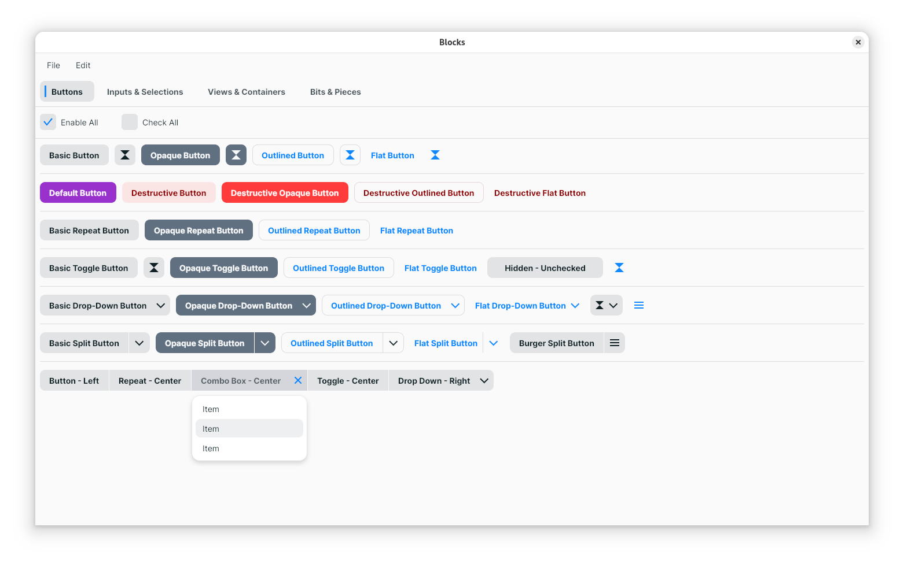
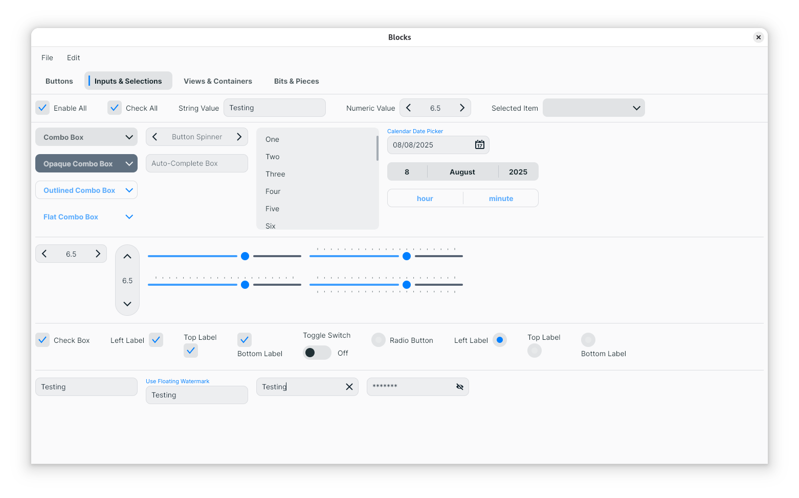
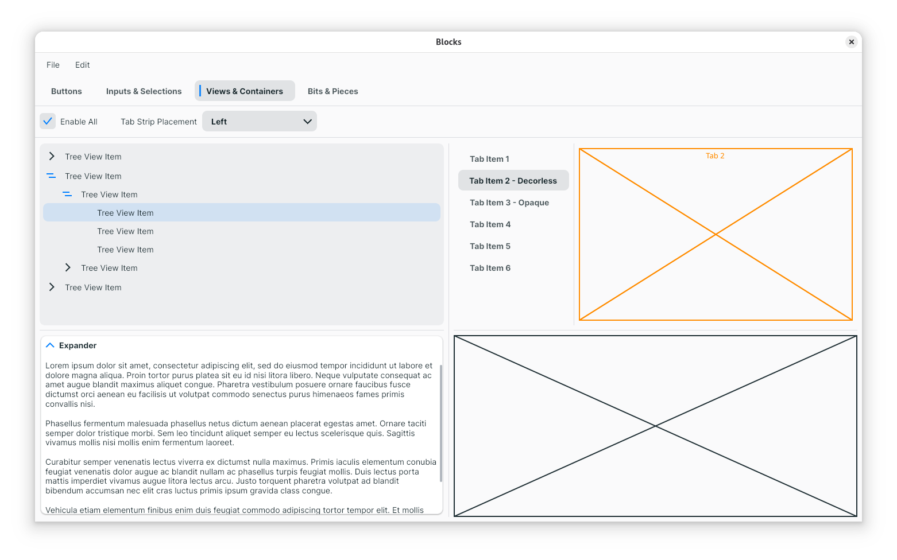
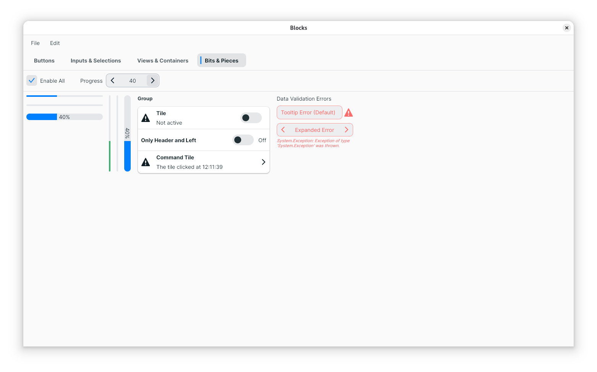

# BLOCKS

A very WIP Avalonia UI theme. It sort of looks like GTK4/Adwaita, with some bits from MS Fluent Design thrown in.

## Current Progress

### Buttons:

### Inputs & Selections:

### Views & Containers:

### Bits & Pieces:

